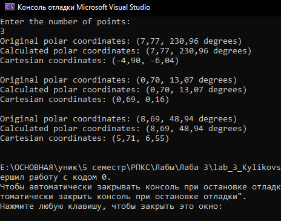
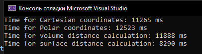

<h2> Перехід між системами координа </h2>

<strong>1.1 Двовимірний простір: Декартова та полярна системи координат
- Задати координати декількох точок у полярній системі координат.
- Перевести ці координати в декартову систему координат.
- Здійснити зворотний перехід з декартової системи координат в полярну.
- Перевірити коректність розрахунків, упевнившись, що вихідні координати співпадають з отриманими після зворотного перетворення.</strong>

Для того, щоб перевести з одної системи координат у іншу, використовують формулу 
з полярної в декартову:
<p align="center">x = r * cos(ϴ)</p>
<p align="center">y = r * sin(ϴ)</p>
з декартової в полярну:
<p align="center">r = √(x^2 + y^2)</p>
<p align="center">ϴ = arctan(y/x)</p>

Нижче написаний код, який реалізує генерацію випадкових полярних координат, зокрема радіусу і кута. Ці координати перетворюються в декартові (x, y) і зберігаються у двох масивах: один для полярних, інший для декартових координат. Після цього код перетворює декартові координати назад у полярні, обчислюючи нові значення радіусу і кута. Він порівнює отримані полярні координати з вихідними, перевіряючи точність перетворень. В кінці код виводить на екран інформацію про вихідні полярні координати, обчислені полярні координати, декартові координати та результати перевірки відповідності.

``` csharp
using System;

class Program
{
    static void Main()
    {
        Random random = new Random();

        Console.WriteLine("Enter the number of points:");
        int n = int.Parse(Console.ReadLine());

        double[,] cartesianCoords = new double[n, 2]; // x и y
        double[,] polarCoords = new double[n, 2]; // радиус и угол

        //Генерируем случайные числа
        for (int i = 0; i < n; i++)
        {
            double radius = random.NextDouble() * 10; // Радіус від 0 до 10
            double angleInDegrees = random.NextDouble() * 360; // Кут від 0 до 360 градусів
            double angleInRadians = angleInDegrees * (Math.PI / 180); // Переведення в радіани

            //Перевод в декартовую
            double x = radius * Math.Cos(angleInRadians);
            double y = radius * Math.Sin(angleInRadians);

            //Сохранение в массиве
            polarCoords[i, 0] = radius;
            polarCoords[i, 1] = angleInDegrees;
            cartesianCoords[i, 0] = x;
            cartesianCoords[i, 1] = y;
        }

        // Цикл перевода из декартовой в полярную и обратно
        for (int i = 0; i < n; i++)
        {
            double radius = Math.Sqrt(cartesianCoords[i, 0] * cartesianCoords[i, 0] + cartesianCoords[i, 1] * cartesianCoords[i, 1]);
            double angle = Math.Atan(cartesianCoords[i, 1] / cartesianCoords[i, 0]) * (180 / Math.PI);

            if (cartesianCoords[i, 0] < 0)
            {
                angle += 180;
            }
            else if (cartesianCoords[i, 0] == 0 && cartesianCoords[i, 1] < 0)
            {
                angle -= 180;
            }

            if (angle < 0) {  angle += 360; }

                // Проверка на правильность перевода
                bool radiusMatch = Math.Abs(radius - polarCoords[i, 0]) < 1e-2;
            bool angleMatch = Math.Abs(angle - polarCoords[i, 1]) < 1e-2;

            Console.WriteLine($"Original polar coordinates: (r = {polarCoords[i, 0]:F2}, θ = {polarCoords[i, 1]:F2} degrees)");
            Console.WriteLine($"Calculated polar coordinates: (r = {radius:F2}, θ = {angle:F2} degrees)");
            Console.WriteLine($"Cartesian coordinates: (x = {cartesianCoords[i, 0]:F2}, y = {cartesianCoords[i, 1]:F2})");
            Console.WriteLine($"Radius match: {radiusMatch}");
            Console.WriteLine($"Angle match: {angleMatch}");
            Console.WriteLine();
        }
    }
}
```

<p align="center">
  
</p>
<p align="center">
    Результат задачі 1.1 
</p>


__1.2. Тривимірний простір: Декартова та сферична системи координат

- Задати координати декількох точок у сферичній системі координат.
- Перевести ці координати в декартову систему координат.
- Здійснити зворотний перехід з декартової системи координат в сферичну.
- Перевірити коректність розрахунків, упевнившись, що вихідні координати співпадають з отриманими після зворотного перетворення.__

Для того, щоб переходити у тривимірному просторі переходити між декартовою та полярною системами координат, використовують наступні формули:
- зі сферичної в декартову:
<p align="center">x = r * sin(ф) * cos(ϴ)</p>
<p align="center">y = r * sin(ф) * sin(ϴ)</p>
<p align="center">z = r * cos(ф)</p>
- з декартової в сферичну
<p align="center">r = √(x^2 + y^2 + z^2)</p>
<p align="center">ϴ = arctan(y/x)</p>
<p align="center">ф = arctan(z/r)</p>

```csharp
using System;

class Program
{
    static void Main()
    {
        Random random = new Random();
        Console.WriteLine("Enter the number of points:");
        int n = int.Parse(Console.ReadLine());

        double[,] sphericalCoords = new double[n, 3]; // r, ϴ, ф
        double[,] cartesianCoords = new double[n, 3]; // x, y, z

        // Генерируем случайные числа
        for (int i = 0; i < n; i++)
        {
            double radius = random.NextDouble() * 10; //расстояние
            double thetaInDegrees = random.NextDouble() * 360; //азимут
            double phiInDegrees = random.NextDouble() * 180; //полярный круг

            //перевод в радианы
            double thetaInRadians = thetaInDegrees * (Math.PI / 180);
            double phiInRadians = phiInDegrees * (Math.PI / 180);

            //перевод в декартовую
            double x = radius * Math.Sin(phiInRadians) * Math.Cos(thetaInRadians);
            double y = radius * Math.Sin(phiInRadians) * Math.Sin(thetaInRadians);
            double z = radius * Math.Cos(phiInRadians);

            sphericalCoords[i, 0] = radius;
            sphericalCoords[i, 1] = thetaInDegrees;
            sphericalCoords[i, 2] = phiInDegrees;
            cartesianCoords[i, 0] = x;
            cartesianCoords[i, 1] = y;
            cartesianCoords[i, 2] = z;
        }

        //Из декартовой в сферическую и проверка
        for (int i = 0; i < n; i++)
        {
            double radius = Math.Sqrt(cartesianCoords[i, 0] * cartesianCoords[i, 0] + cartesianCoords[i, 1] * cartesianCoords[i, 1] + cartesianCoords[i, 2] * cartesianCoords[i, 2]);

            //азимут
            double theta = Math.Atan(cartesianCoords[i, 1] / cartesianCoords[i, 0]) * (180 / Math.PI);
            if (cartesianCoords[i, 0] < 0)
            {
                theta += 180;
            }
            else if (cartesianCoords[i, 0] == 0 && cartesianCoords[i, 1] < 0)
            {
                theta -= 180;
            }

            //полярный круг
            double phi = Math.Acos(cartesianCoords[i, 2] / radius) * (180 / Math.PI);

            //коррекция угла азимута
            if (theta < 0) theta += 360;

            // Проверка
            bool radiusMatch = Math.Abs(radius - sphericalCoords[i, 0]) < 1e-2;
            bool thetaMatch = Math.Abs(theta - sphericalCoords[i, 1]) < 1e-2;
            bool phiMatch = Math.Abs(phi - sphericalCoords[i, 2]) < 1e-2;

            Console.WriteLine($"Original spherical coordinates: (r = {sphericalCoords[i, 0]:F2}, O = {sphericalCoords[i, 1]:F2} degrees, ф = {sphericalCoords[i, 2]:F2} degrees)");
            Console.WriteLine($"Calculated spherical coordinates: (r = {radius:F2}, O = {theta:F2} degrees, ф = {phi:F2} degrees)");
            Console.WriteLine($"Cartesian coordinates: (x = {cartesianCoords[i, 0]:F2}, y = {cartesianCoords[i, 1]:F2}, z = {cartesianCoords[i, 2]:F2})");
            Console.WriteLine($"Radius match: {radiusMatch}");
            Console.WriteLine($"Theta match: {thetaMatch}");
            Console.WriteLine($"Phi match: {phiMatch}");
            Console.WriteLine();
        }
    }
}

```

<p align="center">
  
</p>
<p align="center">
    Результат задачі 1.2
</p>


__2. Розрахунок відстаней у сферичній системі координат:

- Виконати обчислення відстані між точками у сферичній системі координат двома способами:
- Декартова система координат: Використати стандартну формулу для обчислення прямої відстані у двовимірному та тривимірному просторі.
- Полярна система координат: Використати формулу для обчислення відстані між точками у двовимірному просторі.
- Сферична система координат: Виконати обчислення відстані між точками двома способами:
- Через об'єм сфери: використати формулу для прямої відстані у тривимірному просторі.
- По поверхні сфери: використати формулу для великої колової відстані.__


```csharp

```

<p align="center">
  
</p>
<p align="center">
    Результат задачі 2
</p>

__3. Бенчмарки продуктивності:

- Згенерувати масив координат пар точок у кожній системі координат (декартова, полярна, сферична).
- Виконати розрахунок відстаней між цими точками для кожної системи координат.
- Виміряти тривалість обчислень для кожної системи координат.
- Обрати такий розмір масиву, за якого результат бенчмаркінгу матиме незначну варіативність від запуску до запуску (рекомендовано розмір масиву 10,000 - 100,000 точок).__


```csharp

```

<p align="center">
  
</p>
<p align="center">
  
</p>
<p align="center">
  
</p>
<p align="center">
    Результати задачі 3 з різним часов виконання 
</p>
